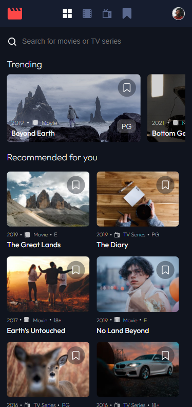
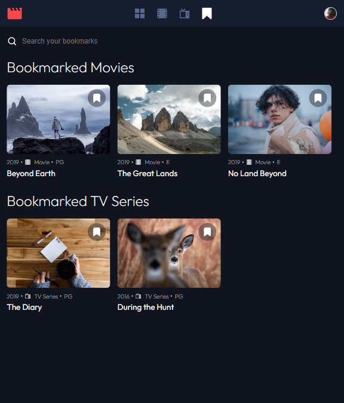
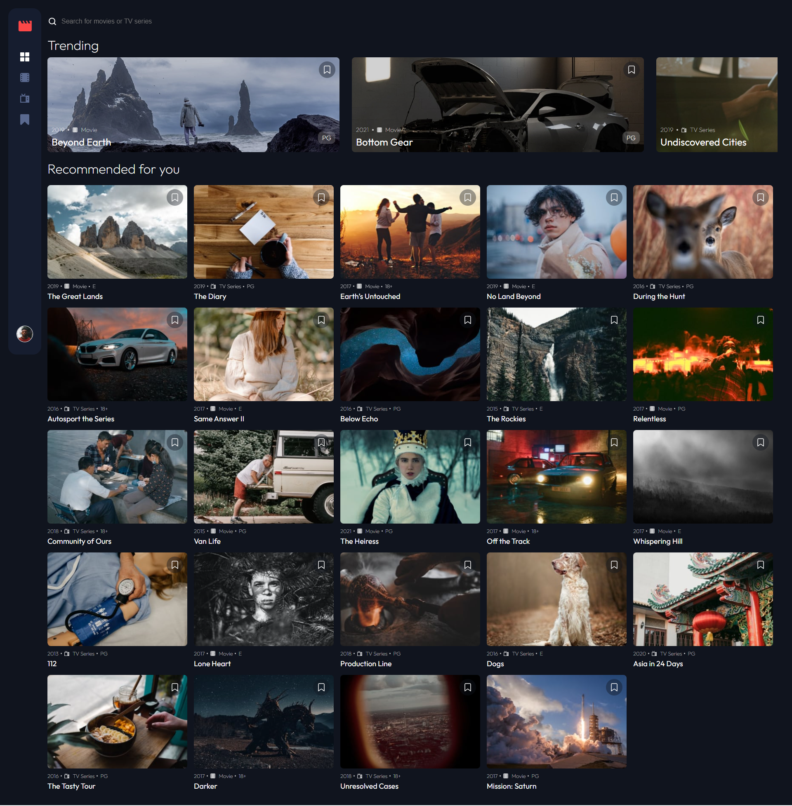

# Frontend Mentor - Entertainment App solution

### Status: Prod (updates-in-progress)

This is a solution to the [Entertainment app challenge on Frontend Mentor](https://www.frontendmentor.io/challenges/entertainment-web-app-J-UhgAW1X/hub).

### Screenshot

**Mobile version**

**Tablet version**

**Desktop version**

## My process

### Built with

-   React / NextJS
-   Figma design files
-   CSS Modules
-   Flexbox
-   Mobile-first workflow
-   FuseJS library (Fuzzy search)
-   Clerk for authentication (including OAuth for Google and GitHub)
-   Axios for API data fetching

##

### Users should be able to:

-   View the optimal layout for the app depending on their device's screen size
-   See hover states for all interactive elements on the page
-   Navigate between Home, Movies, TV Series, and Bookmarked Shows pages
-   Add/Remove bookmarks from all movies and TV series
-   Search for relevant shows on all pages
-   Authenticate using Clerk, with custom auth flow and OAuth support for Google and GitHub

### Future Enhancements

-   Collections page for users to create collections and save items to them
-   Fetch more results from the API and implement pagination
-   Filter results on the pages by different queries such as genre, release date, etc.
-   Ability to leave reviews on items that are viewable by anyone
-   Add a demo user account with custom permissions so that users can access the site without needing an account

## Author

-   [Portolio](https://www.joshuahovis.com/)
-   [GitHub](https://github.com/joshhovis)
-   [LinkedIn](https://www.linkedin.com/in/joshua-hovis/)
-   [@joshhovis](https://www.frontendmentor.io/profile/joshhovis)
