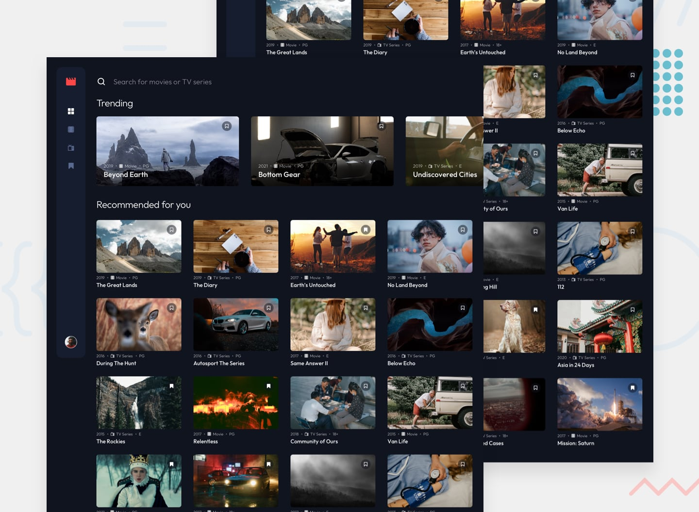

# Frontend Mentor - Entertainment web app

## Design preview

## Overview

This project is a Next.js application for browsing movies and TV series.

### MVP

Your users should be able to:

-   View the optimal layout for the app depending on their device's screen size
-   See hover states for all interactive elements on the page
-   Navigate between Home, Movies, TV Series, and Bookmarked Shows pages
-   Add/Remove bookmarks from all movies and TV series
-   Search for relevant shows on all pages

#### Expected Behaviour

-   General
    -   The navigation menu should be fixed to the left for larger screens.
-   Home
    -   The trending section should scroll sideways to reveal other trending shows
    -   Any search input should search through all shows (i.e. all movies and TV series)
-   Movies
    -   This page should only display shows with the "Movie" category
    -   Any search input should search through all movies
-   TV Series
    -   This page should only display shows with the "TV Series" category
    -   Any search input should search through all TV series
-   Bookmarked Shows
    -   This page should display all bookmarked shows from both categories
    -   Any search input should search through all bookmarked shows

#### ETA

-   5 days **(Completed in: 3 days)**

### Future Enhancements

-   Personalized pages for each movie/show with additional data.
-   Fetch data from an API instead of hard-coded values.
-   Implement user authentication
    -   Page to edit user info (Change name, email, password, etc)
        -   CRUD
    -   Ability to create personal collections
        -   CRUD

### Author

-   [Portolio](https://www.joshuahovis.com/)
-   [GitHub](https://github.com/joshhovis)
-   [LinkedIn](https://www.linkedin.com/in/joshua-hovis/)
-   [@joshhovis](https://www.frontendmentor.io/profile/joshhovis)
